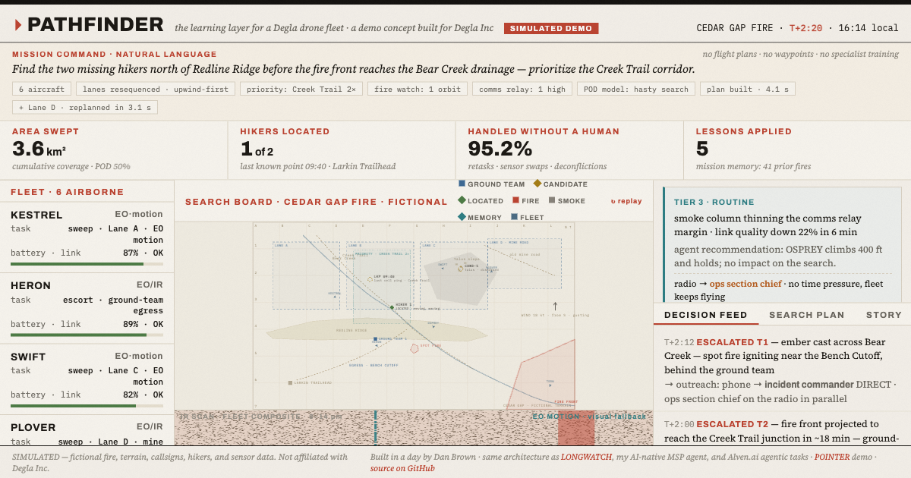

# PATHFINDER

**The learning layer for a Degla drone fleet — a simulated demo concept.**

**▶ Live demo: https://danbrown-coder.github.io/pathfinder/** (plays a ~2-minute scripted mission on load, then keeps running)

One typed sentence — *"Find the two missing hikers north of Redline Ridge before the fire front reaches the Bear Creek drainage — prioritize the Creek Trail corridor."* — becomes a six-aircraft wildfire search-and-rescue mission. No flight plans, no waypoints. Then the layer this demo is actually about kicks in:

- **Short-term learning** — the fleet adapts mid-mission on its own: the wind veers and the sweep re-sequences upwind-first; a crown fire blinds the thermal cameras and two aircraft switch to visual motion detection before anyone notices.
- **Long-term learning** — a visible *mission memory*. Lessons from past fires are recalled with citations ("Lesson 112 · Fire 2026-14"), one of them makes the second find, and at the debrief the fleet writes three new lessons. Next fire, it starts smarter.
- **Humans where it matters** — three escalation tiers, from "routine, no rush" to "acting now, 30-second override window." Everything else is handled, logged, filed.

## Notes

- **SIMULATED** — fictional fire, terrain, callsigns, hikers, and sensor data. Not affiliated with Degla Inc.
- Single self-contained `index.html` — vanilla JS/SVG/canvas, no frameworks, no build step; the only external request is Google Fonts.
- Built in a day by Dan Brown · same architecture as [LONGWATCH](https://danbrown-coder.github.io/longwatch/) and [POINTER](https://danbrown-coder.github.io/pointer/).
